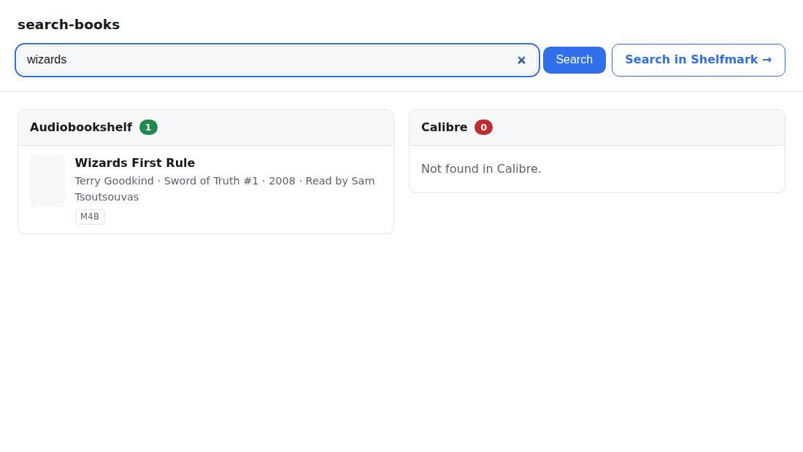

# search-books

A small self-hosted web app that answers one question fast: **do I already have this book?**

It runs a single query against **Audiobookshelf** and **Calibre** (either the Calibre
content server or Calibre-Web) and shows the two result sets **side by side, separately** —
so a gap on one side is obvious at a glance. If something is missing, one click hands the
same query off to **Shelfmark**.

There is no authentication: put it behind whatever auth proxy you already run.



## Quick start

```bash
docker run --rm -p 8080:8080 \
  -e AUDIOBOOKSHELF_URL=https://abs.example.com \
  -e AUDIOBOOKSHELF_TOKEN=your-api-token \
  -e CALIBRE_BACKEND=content-server \
  -e CALIBRE_URL=http://calibre.example.com:8080 \
  -e SHELFMARK_URL=https://shelfmark.example.com \
  ghcr.io/martinca/search-books:latest
```

Then open <http://localhost:8080>.

A ready-to-edit [`docker-compose.yml`](docker-compose.yml) is included.

## Configuration

Everything is configured with environment variables. A source with no URL set is simply
reported as *not configured* in the UI instead of erroring.

### Audiobookshelf

| Variable | Default | Description |
| --- | --- | --- |
| `AUDIOBOOKSHELF_URL` | — | Base URL, e.g. `https://abs.example.com`. Unset disables the source. |
| `AUDIOBOOKSHELF_TOKEN` | — | API token. Log in as admin → *Settings → Users* → your account. |
| `AUDIOBOOKSHELF_LIBRARY_IDS` | — | Comma-separated library IDs, e.g. `lib_abc,lib_def`. Unset means *all* libraries the token can see, discovered once at first search — add a library later and you need a restart. |
| `AUDIOBOOKSHELF_INCLUDE_PODCASTS` | `false` | Also search podcast libraries. |

### Calibre

| Variable | Default | Description |
| --- | --- | --- |
| `CALIBRE_BACKEND` | `auto` | `content-server`, `calibre-web`, `none`, or `auto`. `auto` picks `content-server` when `CALIBRE_URL` is set, otherwise `none`. |
| `CALIBRE_URL` | — | Base URL of calibre-server or Calibre-Web. Unset disables the source. |
| `CALIBRE_USERNAME` | — | HTTP Basic username, if your instance requires auth. |
| `CALIBRE_PASSWORD` | — | HTTP Basic password. |
| `CALIBRE_LIBRARY_ID` | — | Content-server library ID, for multi-library setups. |

`content-server` talks to calibre's own JSON API (`/ajax/search` + `/ajax/books`) and gives
the richest metadata — formats, series index, published date. Use it if you run
`calibre-server` (the one calibre itself ships, usually on port 8080).

`calibre-web` talks to Calibre-Web's OPDS feed (`/opds/search`). Use it if Calibre-Web is
the only thing you expose. Metadata is thinner but it needs no extra service.

### Shelfmark

| Variable | Default | Description |
| --- | --- | --- |
| `SHELFMARK_URL` | — | Base URL. Unset hides the handoff button. |
| `SHELFMARK_CONTENT_TYPE` | `combined` | `combined`, `ebook`, or `audiobook`. Preselects Shelfmark's search mode. |

The button opens `{SHELFMARK_URL}/?q=<query>&content_type=<type>`, which Shelfmark parses
on load and runs automatically.

### Server

| Variable | Default | Description |
| --- | --- | --- |
| `SEARCH_LIMIT` | `25` | Max results per source. |
| `REQUEST_TIMEOUT` | `10.0` | Per-request timeout in seconds. |
| `VERIFY_TLS` | `true` | Set `false` for internal self-signed certificates. |
| `LOG_LEVEL` | `INFO` | Python log level. |
| `HOST` | `0.0.0.0` | Bind address. Read by the container entrypoint, not the app — running uvicorn yourself means passing `--host`. |
| `PORT` | `8080` | Bind port. Same caveat as `HOST`. |

## HTTP API

| Endpoint | Description |
| --- | --- |
| `GET /` | The search page. Accepts `?q=` so result pages are linkable. |
| `GET /api/search?q=` | JSON results. `400` when `q` is empty. |
| `GET /api/cover/{source}/{item_id}` | Cover proxy, so credentials never reach the browser. |
| `GET /healthz` | Health check. |

`/api/search` always returns `200` when at least one source is configured; a source that
failed is reported inline, so **one dead backend never blanks the other**:

```json
{
  "query": "wizards first rule",
  "shelfmark_url": "https://shelfmark.example.com/?q=wizards+first+rule&content_type=combined",
  "sources": [
    {"key": "audiobookshelf", "label": "Audiobookshelf", "status": "ok", "count": 1, "results": [...]},
    {"key": "calibre", "label": "Calibre", "status": "error", "error": "HTTP 502", "count": 0, "results": []}
  ]
}
```

## Development

Requires [uv](https://docs.astral.sh/uv/) and Python 3.14.

```bash
uv sync --all-groups
uv run ruff check .
uv run ruff format --check .
uv run pytest
uv run uvicorn app.main:app --reload
```

Tests never touch the network — every backend is mocked with
[respx](https://lundberg.github.io/respx/).

## License

MIT
